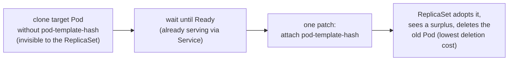

# soft-drain

Drain Kubernetes nodes without dropping a single replica — even for `replicas: 1` Deployments.

`kubectl drain` evicts first and lets the workload recover later. For a single-replica
Deployment that means downtime on every node maintenance; a PDB only turns the downtime
into a stuck drain. The upstream feature request to surge before draining was
[closed as not planned](https://github.com/kubernetes/kubernetes/issues/114877).

soft-drain does it the other way around: **it brings a new Pod up first, waits until it
is Ready, and only then lets the old one go.** Capacity never dips.

It was born operating on-premise GPU clusters — where nodes need hands-on maintenance,
capacity is too expensive to double for HA, and single-replica inference servers are
the norm. Nothing about it is GPU-specific, though: it works for any Deployment.

## How it works

A ReplicaSet has two documented behaviors:

1. It adopts an ownerless Pod that matches its selector.
2. When it has more children than `replicas`, it deletes the one with the lowest
   [`pod-deletion-cost`](https://kubernetes.io/docs/reference/labels-annotations-taints/#pod-deletion-cost) first.

soft-drain chains the two:



**The ReplicaSet moves the Pod. soft-drain just sets the table.** No eviction API, no
PDB interaction, no Deployment spec changes — the only thing written to your workload
is one annotation on the outgoing Pod.

Because `pod-template-hash` is part of the ReplicaSet selector but not the Service
selector, the replacement starts serving the moment it is Ready and never drops out of
Endpoints during adoption.

## Usage

The API is a node label. That's all of it.

```bash
kubectl label node node-01 soft-drain.com/drain=true      # start
kubectl get nodes -l soft-drain.com/state=Complete        # check
kubectl label node node-01 soft-drain.com/drain-          # cancel
kubectl uncordon node-01                                  # also cancels
```

The controller cordons the node, moves every Deployment-owned Pod as described above,
then labels the node `soft-drain.com/state=Complete`. The node stays cordoned —
rebooting or deleting it afterwards is your call, not soft-drain's.

| Node state label | Meaning |
|---|---|
| `InProgress` | Pods are being moved |
| `Complete` | Every Deployment Pod has left; the node stays cordoned |
| `Cancelled` | Someone uncordoned the node mid-drain; soft-drain backed off |

### kubectl plugin

A thin wrapper with `git stash`-style grammar — the bare node form mirrors
`kubectl drain NODE`, and everything else is a subcommand. It writes the label above
and watches the rest:

```bash
# from a release (binary + shell completion; pick your os_arch)
curl -sL https://github.com/rogeeoh/soft-drain/releases/download/v0.1.0/kubectl-soft_drain_0.1.0_darwin_arm64.tar.gz \
  | tar xz -C ~/bin kubectl-soft_drain kubectl_complete-soft_drain
# or from source
make plugin && cp bin/kubectl-soft_drain hack/kubectl_complete-soft_drain ~/bin/

kubectl soft-drain node-01 node-02        # label + progress until all Complete
kubectl soft-drain node-01 --wait=false   # label only
kubectl soft-drain status                 # every node under soft-drain (-o json|yaml)
kubectl soft-drain release node-01 ...    # remove the labels, wait for restore
kubectl soft-drain version                # plugin version
```

`release` cancels an in-flight drain and retires a completed one — both are the same
label removal. (`kubectl uncordon` also cancels, but leaves the label and a
`Cancelled` latch; `release` removes both.) On `--timeout` the plugin prints the
pending replacement Pods and their scheduler messages, so a stuck drain diagnoses
itself.

## Installation

With Helm:

```bash
helm install soft-drain oci://ghcr.io/rogeeoh/charts/soft-drain \
  --namespace soft-drain-system --create-namespace
```

With plain manifests (attached to each [release](https://github.com/rogeeoh/soft-drain/releases)):

```bash
kubectl apply -f https://github.com/rogeeoh/soft-drain/releases/latest/download/install.yaml
```

From source:

```bash
git clone https://github.com/rogeeoh/soft-drain && cd soft-drain
make deploy
```

Requires Kubernetes ≥ 1.22 (`pod-deletion-cost`).

## Wiring it into automation

The node labels are the whole contract — a pipeline needs nothing but kubectl:

```bash
kubectl label node "$NODE" soft-drain.com/drain=true
kubectl wait node/"$NODE" --timeout=2h \
  --for=jsonpath='{.metadata.labels.soft-drain\.com/state}'=Complete
# state=Cancelled instead means a human uncordoned the node: abort your pipeline.
kubectl label node "$NODE" soft-drain.com/drain-   # release once you are done
```

Or let the plugin do the waiting and gate on its exit code:

```bash
kubectl soft-drain "$NODE" --timeout 2h && retire-node "$NODE"
```

Exit codes: `0` drained, `1` failed or timed out (pending replacements and their
scheduler messages go to stderr), `130` interrupted — the drain keeps running.

A human or pipeline driving drains needs only this RBAC (the controller's own
ServiceAccount is the only thing that ever creates or deletes Pods):

```yaml
rules:
  - apiGroups: [""]
    resources: [nodes]
    verbs: [get, list, watch, patch]
  - apiGroups: [""]
    resources: [pods]
    verbs: [get, list]
```

## What it guarantees — and what it doesn't

**Guaranteed:** available replicas never drop below `spec.replicas` because of the
drain. New capacity is always Ready before old capacity is removed, and handover is
gated on the Deployment being healthy (no rollout in flight, availability at spec).

**Not guaranteed:** *which* Pod dies. `pod-deletion-cost` is a hint, fourth in the
deletion sort order. If an unrelated Pod happens to be NotReady at handover time the
ReplicaSet may delete that one instead — exposure still never dips, and the remaining
target is retried next round.

**Scope:** Deployment-owned Pods only. StatefulSets, DaemonSets, Jobs, and bare Pods
are left untouched — `Complete` means "my share is done", not "the node is empty".
When there is no room for a replacement, it stays Pending and the drain waits; freeing
capacity is a human decision.

## Compared to the alternatives

| approach | mechanism | r=1 downtime | touches workload spec | server-side footprint |
|---|---|---|---|---|
| `kubectl drain` | evict, then recover | yes | no | none |
| cordon + `rollout restart` scripts | restart the whole Deployment | ~none | yes (template annotation) | none |
| descheduler | evict per policy, scheduler recovers | yes (delete-first) | no | none (policy ConfigMap) |
| migration controllers (koordinator-style) | reserve resources, then evict | yes (delete-first) | no | CRDs |
| eviction-webhook operators | hold evictions (429) while surging `replicas` | ~none | yes (`spec.replicas`) | CRD + admission webhook |
| **soft-drain** | **create → adopt → let RS delete** | **none** | **no** | **one controller, label-only API** |

The design principle: **don't fight the controllers — enlist them.** The move
is executed by the ReplicaSet that owns the Pod, so nothing races to undo it.
`spec.replicas` is never written, so your HPA and your GitOps never see a diff. No
webhook holds evictions, so nothing fails open and there is nothing extra to keep
highly available. No CRD — a label is the entire API. And the reconciler is
memoryless: every decision is recomputed from cluster state, so controller restarts
are non-events.

## Known limitations

- **No spare capacity, no progress.** Room appears only when the old Pod dies, and the
  old Pod dies only after the new one is Ready. At 100% utilization the drain waits.
- Workloads that cap themselves at one Pod per node with required `podAntiAffinity`
  on a full cluster cannot surge — same arithmetic as `maxSurge: 1` rollouts.
- Workloads tolerating `node.kubernetes.io/unschedulable` may land replacements back
  on the draining node; soft-drain deletes and retries (with a Warning event each time)
  rather than overriding the toleration with an injected affinity.
- Pre-adoption replacements are ownerless, which nudges PDB accounting
  (`disruptionsAllowed` +1 while they exist) and blocks Cluster Autoscaler
  consolidation of the node they run on.
- The original `pod-deletion-cost` value of a target Pod is not restored.

## Testing

Three tiers, all green:

- **unit** — pure judgment functions
- **envtest** — everything the controller writes to the API server, including
  hand-arranged race interleavings (judge-vs-delete, adopt-vs-recreate)
- **kind e2e — 31 scenarios** with continuous availability probes: multi-Deployment
  simultaneous drains, both cancel paths, rollout overlap, controller restart and
  controller absence mid-drain, manual meddling (deleting replacements, stripping
  costs), permanently-NotReady replacements, full-cluster drain deadlock and release,
  PDB coexistence, and the controller draining **its own node**

```bash
make test        # unit + envtest
make test-e2e    # kind cluster, ~15 min
```

## Design

The full design rationale lives in [DESIGN.md](DESIGN.md) (Korean; English translation
planned). It is the source of truth for how the controller behaves.
